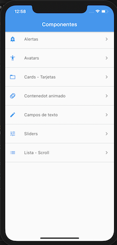
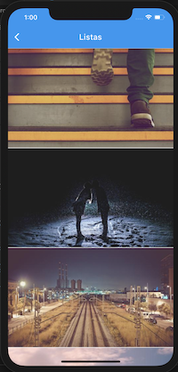
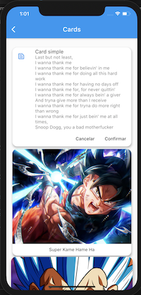
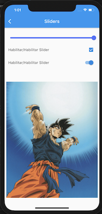

# components

A Flutter APP that use different Widgets to understand how they work

Applying the concepts:

* Listviews
* Pull to refresh
* InfiniteScroll
* Loadings
* Assets
* Future Builder
* Routes
* and more...

# Functionality
An APP Android/iOS which consists in how work the commons Widgets, such as: AlertDialog, FadeInImage, Routes and Navigator.pushNamed, Cards, Sliders, CheckboxListTile, SwitchListTile, InputDecoration, DropdownButton, etc.
There are diferents pages or screens that put into practice
the above widgets with examples.

## Screenshots

|  Welcome      |  ListView.builder      |  Cards      |  Slider      |
|------------|-------------|------------|------------|
|  |    |  |  |
